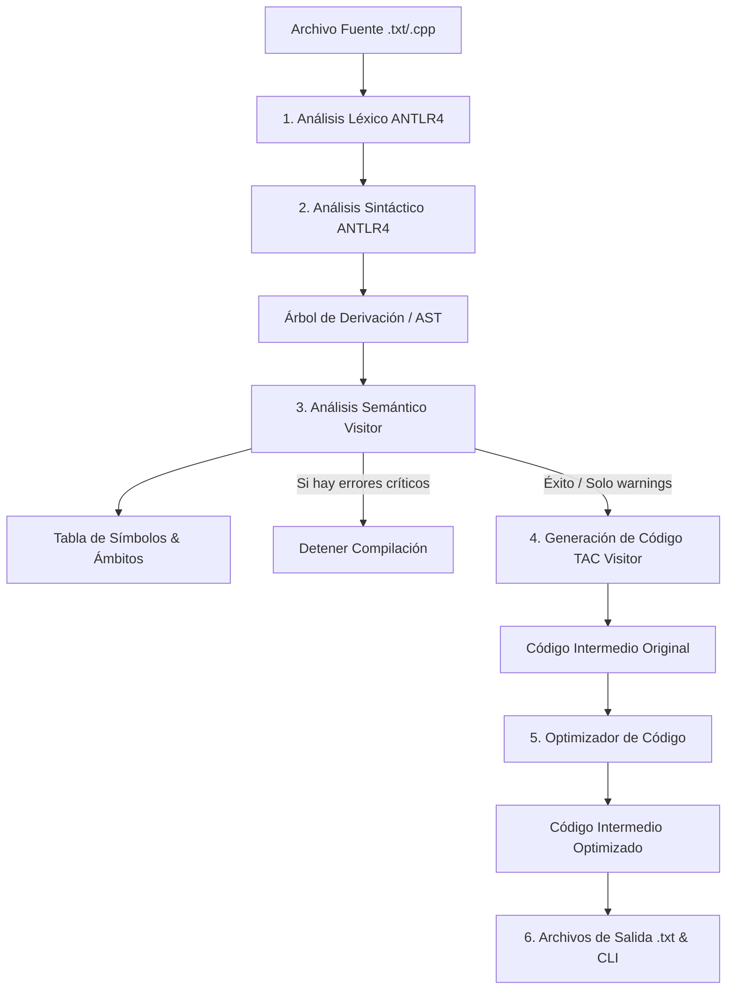

# Informe Técnico y Guía de Defensa: Compilador C++ a TAC

Este documento proporciona una explicación completa de la arquitectura, el código fuente y el cumplimiento de los hitos del proyecto final para la materia **Técnicas de Compilación**. Su propósito es servir como material de estudio y guía práctica para la defensa del proyecto ante el tribunal/profesor.

---

## 📖 Contenido
1. [Introducción y Objetivos](#1-introducción-y-objetivos)
2. [Arquitectura General del Compilador](#2-arquitectura-general-del-compilador)
3. [Explicación Detallada de los Hitos e Implementación](#3-explicación-detallada-de-los-hitos-e-implementación)
   - [Hito 1: Análisis Léxico](#hito-1-análisis-léxico)
   - [Hito 2: Análisis Sintáctico y AST](#hito-2-análisis-sintáctico-y-ast)
   - [Hito 3: Análisis Semántico y Tabla de Símbolos](#hito-3-análisis-semántico-y-tabla-de-símbolos)
   - [Hito 4: Generación de Código Intermedio (TAC)](#hito-4-generación-de-código-intermedio-tac)
   - [Hito 5: Optimización de Código](#hito-5-optimización-de-código)
   - [Hito 6: Salidas e Integración (CLI)](#hito-6-salidas-e-integración-cli)
4. [Guía para la Defensa (Preguntas Frecuentes de Examen)](#4-guía-para-la-defensa-preguntas-frecuentes-de-examen)
5. [Análisis de los Casos de Prueba (Ejemplos)](#5-análisis-de-los-casos-de-prueba-ejemplos)

---

## 1. Introducción y Objetivos

El objetivo de este proyecto es diseñar e implementar un compilador completo para un **subconjunto del lenguaje C++** utilizando la herramienta **ANTLR4** en **Java 8**. 

El compilador acepta programas estructurados con tipos de datos estándar, estructuras de control (`if-else`, loops `while`, `do-while`, `for`, `switch-case`) y funciones personalizadas, traduciéndolos a un **Código de Tres Direcciones (TAC)** intermedio, aplicándole optimizaciones avanzadas de código y generando reportes coloreados en la consola.

### Subconjunto de C++ soportado:
*   **Tipos de datos**: `int`, `double`, `char`, `bool`, `void` (para funciones) y arrays de tipos básicos (`int arr[10]`).
*   **Estructuras de Control**: Bifurcaciones (`if`/`else`), bucles (`while`, `do-while`, `for` con declaraciones de inicializador local), sentencias `switch-case` (incluyendo `default`), y flujos de interrupción (`break`, `continue`).
*   **Funciones**: Declaraciones con firmas tipadas y argumentos múltiples, retornos de valores (`return <expr>`) y llamadas a funciones.

---

## 2. Arquitectura General del Compilador

El compilador sigue la estructura clásica de tubería (pipeline) de compilación de software:



Cada fase se desacopla mediante patrones de diseño, principalmente el patrón **Visitor**, lo que permite recorrer la representación intermedia producida por ANTLR sin contaminar la gramática.

---

## 3. Explicación Detallada de los Hitos e Implementación

### Hito 1: Análisis Léxico

El **Análisis Léxico** se encarga de agrupar los caracteres del código fuente en unidades con significado lógico llamadas **Tokens** (palabras clave, identificadores, constantes y operadores).

*   **Implementación**: Definido en el archivo de gramática [MiLenguaje.g4](file:///c:/Users/gasto/OneDrive/Escritorio/Ejercicios_Sintacticos-ejercicio1/Ejercicio/demo/src/main/antlr4/com/compilador/MiLenguaje.g4).
*   **Manejo de Errores**: En [App.java](file:///c:/Users/gasto/OneDrive/Escritorio/Ejercicios_Sintacticos-ejercicio1/Ejercicio/demo/src/main/java/com/compilador/App.java), eliminamos los escuchas de error por defecto de ANTLR y añadimos un `BaseErrorListener` personalizado. Si se encuentra un caracter extraño o ilegal (por ejemplo, `@`), se atrapa el error, se registra la línea y la columna exacta y se almacena en la lista `erroresLexicos` para detener el proceso.
*   **Salida**: Si el análisis léxico es exitoso, la CLI imprime en consola la cantidad de tokens procesados.

### Hito 2: Análisis Sintáctico y AST

El **Análisis Sintáctico** evalúa si la secuencia de tokens provista por el analizador léxico cumple con las reglas gramaticales del lenguaje.

*   **Implementación**: La estructura de la gramática en [MiLenguaje.g4](file:///c:/Users/gasto/OneDrive/Escritorio/Ejercicios_Sintacticos-ejercicio1/Ejercicio/demo/src/main/antlr4/com/compilador/MiLenguaje.g4) define producciones precisas para sentencias e instrucciones.
*   **Precedencia de Expresiones**: Para evitar ambigüedades en expresiones matemáticas sin forzar una gramática engorrosa, usamos las características de precedencia automática de ANTLR4. Las reglas están ordenadas desde el operador de menor prioridad (asignaciones) hasta el de mayor prioridad (factores literales e identificadores):
    ```antlr
    expr : lvalue IGUAL expr                                 # Assignment
         | expr OR expr                                      # LogicalOr
         | expr AND expr                                     # LogicalAnd
         | expr EQL expr                                     # Equality
         | expr (MAYOR | MAYOR_IGUAL | MENOR | ...) expr     # Comparison
         | expr SUM expr                                     # Addition
         | expr RES expr                                     # Subtraction
         | ...
    ```
*   **Visualización**: El método `mostrarArbolGrafico` en [App.java](file:///c:/Users/gasto/OneDrive/Escritorio/Ejercicios_Sintacticos-ejercicio1/Ejercicio/demo/src/main/java/com/compilador/App.java) utiliza el componente gráfico `TreeViewer` de ANTLR para abrir una interfaz de usuario Java Swing, permitiendo observar gráficamente la jerarquía y derivaciones del árbol.

### Hito 3: Análisis Semántico y Tabla de Símbolos

El analizador semántico valida la "coherencia lógica" y las reglas contextuales del programa que la sintaxis pura no puede capturar (como tipos válidos y ámbitos).

*   **Tabla de Símbolos e Hilos de Ámbito**:
    Implementada en [TablaSimbolos.java](file:///c:/Users/gasto/OneDrive/Escritorio/Ejercicios_Sintacticos-ejercicio1/Ejercicio/demo/src/main/java/com/compilador/TablaSimbolos.java). Cuenta con la clase `Symbol` (que almacena nombre, tipo, categoría, línea, columna, ámbito, tamaño del vector y firmas de parámetros) y la clase `Scope`. Los ámbitos se estructuran en forma de árbol usando un puntero `parent`. La resolución de nombres sube por la jerarquía (`resolve(name)`), mientras que las declaraciones se limitan al `currentScope` actual para impedir duplicados.
*   **El Visitor Semántico**:
    [SemanticVisitor.java](file:///c:/Users/gasto/OneDrive/Escritorio/Ejercicios_Sintacticos-ejercicio1/Ejercicio/demo/src/main/java/com/compilador/SemanticVisitor.java) hereda de `MiLenguajeBaseVisitor<String>`. Su función es devolver el tipo de dato de cada subnodo (por ejemplo, `"int"`, `"double"`, `"bool"`, `"char"`) para realizar el chequeo de tipos:
    *   **Ámbitos Locales**: Abre ámbitos al entrar en funciones (`visitDeclaracionFuncion`), bloques de sentencias y bucles.
    *   **Doble Declaración**: Valida si el identificador existe en el `currentScope`. Si es así, reporta un error crítico.
    *   **Variables no Declaradas**: Si `resolve(id)` retorna `null` cuando se usa un identificador, se reporta un error.
    *   **Chequeo de Tipos**: Verifica compatibilidad en expresiones. Por ejemplo, la suma requiere operandos numéricos y los índices de arrays deben ser de tipo `int`.
    *   **Verificación de Retornos**: Asegura que las funciones no-void alcancen una instrucción `return` compatible con su firma.
    *   **Warnings Semánticos**: Al concluir el análisis, se recorren todos los símbolos y aquellos marcados con `usado == false` disparan alertas de variables declaradas pero nunca leídas.

### Hito 4: Generación de Código Intermedio (TAC)

El código de tres direcciones (TAC) es una representación plana e independiente de la máquina donde cada instrucción tiene a lo sumo un operador y tres direcciones (dos operandos y un resultado).

*   **Representación**: Cada instrucción en memoria es una instancia de [Instruccion.java](file:///c:/Users/gasto/OneDrive/Escritorio/Ejercicios_Sintacticos-ejercicio1/Ejercicio/demo/src/main/java/com/compilador/Instruccion.java), que encapsula `op`, `arg1`, `arg2`, y `result`. Tiene una lógica de representación textual limpia en su método `toString()`.
*   **Visitor de Generación**:
    Implementado en [CodigoVisitor.java](file:///c:/Users/gasto/OneDrive/Escritorio/Ejercicios_Sintacticos-ejercicio1/Ejercicio/demo/src/main/java/com/compilador/CodigoVisitor.java). Utiliza un contador incremental para variables temporales (`t1`, `t2`, ...) y etiquetas de control de flujo (`L1`, `L2`, ...).
    *   **Asignaciones**: Reduce `x = a + b * c` en pasos planos:
        ```
        t1 = b * c
        t2 = a + t1
        x = t2
        ```
    *   **Control de Flujo (`if-else`, loops)**: Implementa saltos condicionales (`IF <cond> GOTO L1`) e incondicionales (`goto L2`).
        Para los bucles, utiliza una pila `loopStartLabels` y `loopEndLabels` que permite desviar correctamente las instrucciones `break` y `continue` a las etiquetas del contexto activo.
    *   **Funciones**: Las funciones generan instrucciones de demarcación `FUNC_START`, parámetros `PARAM` y llamadas tipadas `CALL func, num_args`.

### Hito 5: Optimización de Código

El optimizador mejora la eficiencia del código intermedio reduciendo su tamaño y el número de instrucciones ejecutadas.

*   **Implementación**: Desarrollada en [Optimizador.java](file:///c:/Users/gasto/OneDrive/Escritorio/Ejercicios_Sintacticos-ejercicio1/Ejercicio/demo/src/main/java/com/compilador/Optimizador.java).
*   **Estrategia Multipaso**: Ejecuta las fases de optimización secuencialmente en un bucle `while`. Si una fase modifica el código (medido por cambios de instrucciones), se vuelve a ejecutar hasta un máximo de 10 pasadas o hasta estabilidad (punto fijo).
*   **Optimidades Soportadas**:
    1.  **Plegado de Constantes (Constant Folding)**: Evalúa expresiones aritméticas, relacionales y lógicas constantes en tiempo de compilación. Por ejemplo, `t1 = 5 + 3` se reescribe como `t1 = 8`.
    2.  **Propagación de Constantes (Constant Propagation)**: Reemplaza variables cargadas con constantes por sus valores literales en operaciones subsecuentes. Se limpia el mapa de constantes al encontrar una etiqueta (`LABEL`), garantizando seguridad frente a saltos condicionales y bucles.
    3.  **Simplificación Algebraica**: Simplifica operaciones con elementos neutros u nulos:
        *   Suma con 0: `x + 0` o `0 + x` $\rightarrow$ `x`
        *   Resta con 0: `x - 0` $\rightarrow$ `x`
        *   Multiplicación por 1: `x * 1` o `1 * x` $\rightarrow$ `x`
        *   Multiplicación por 0: `x * 0` o `0 * x` $\rightarrow$ `0`
    4.  **Eliminación de Código Muerto**:
        *   **Instrucciones Inalcanzables**: Al encontrar un salto incondicional `goto` o un `return`, descarta todas las instrucciones siguientes hasta encontrar la siguiente etiqueta (`LABEL` o `FUNC_START`), ya que no hay forma física de alcanzarlas.
        *   **Eliminación de Temporales Huérfanos**: Cuenta las referencias de lectura de los temporales (`t1`, `t2`, ...). Si un temporal es asignado pero nunca leído (debido a que su valor se propagó o plegó), la instrucción de asignación es eliminada del programa final.

### Hito 6: Salidas e Integración (CLI)

*   **Punto de Entrada**: Centralizado en [App.java](file:///c:/Users/gasto/OneDrive/Escritorio/Ejercicios_Sintacticos-ejercicio1/Ejercicio/demo/src/main/java/com/compilador/App.java).
*   **Control de Errores Semánticos**: Si el análisis semántico recolecta algún error crítico, los imprime en la consola usando códigos de escape ANSI de color rojo y finaliza con `System.exit(1)`, previniendo la generación de archivos de salida con código incorrecto.
*   **Archivos de Salida**: Escribe los archivos `<archivo>_codigo_intermedio.txt` y `<archivo>_codigo_optimizado.txt` de manera automática en el mismo directorio del archivo analizado.
*   **Estadísticas de Optimización**: Compara la cantidad de instrucciones válidas (excluyendo comentarios) generadas originalmente contra el código final optimizado, mostrando el porcentaje de reducción exacto en consola (color verde).

---

## 4. Guía para la Defensa (Preguntas Frecuentes de Examen)

### ❓ P1: ¿Por qué usaron el patrón Visitor en vez del patrón Listener para el Análisis Semántico y la Generación de TAC?
*   **Respuesta**: El patrón **Listener** realiza un recorrido pasivo del árbol de forma automática provisto por ANTLR y no permite controlar el orden en que se visitan los nodos hijos. El patrón **Visitor** nos permite recorrer el árbol de manera activa: podemos retornar valores (como el tipo de dato de una subexpresión para verificar compatibilidad semántica) y controlar cuándo y bajo qué condiciones visitar los hijos (clave para implementar bifurcaciones de control como `if-else`, cortocircuitos lógicos, bucles y switch-case en la generación de código TAC).

### ❓ P2: ¿Cómo maneja el compilador las variables con el mismo nombre en diferentes funciones o bloques?
*   **Respuesta**: Gracias a la estructura de la tabla de símbolos estructurada con la clase `Scope`. Cuando se entra a una función o bloque `{...}`, abrimos un ámbito (`openScope(name)`), el cual mantiene una referencia a su ámbito padre (`parent`). Si declaramos una variable en un ámbito interno, se registra allí y no colisiona con el ámbito externo. Al buscar una variable para su uso, el método `resolve(name)` busca primero localmente; si no la encuentra, sube recursivamente al ámbito padre. Al salir del bloque, cerramos el ámbito (`closeScope()`), retornando al nivel de anidamiento anterior.

### ❓ P3: ¿Por qué es seguro propagar constantes en su optimizador si existen saltos y etiquetas?
*   **Respuesta**: La propagación de constantes simple puede causar optimizaciones erróneas si se cruza una etiqueta de salto (ya que no sabemos de qué flujo proviene la ejecución). Para evitar este problema de manera simple y segura, nuestro `Optimizador` limpia completamente el mapa de constantes (`constMap.clear()`) al encontrar cualquier instrucción `LABEL` o `FUNC_START`. Esto confina la propagación de constantes al interior de bloques básicos planos, garantizando que sea 100% segura.

### ❓ P4: ¿Cómo se implementa la precedencia de operadores en su gramática?
*   **Respuesta**: ANTLR4 evalúa las reglas de expresión alternativas de arriba hacia abajo. Al definir las reglas de mayor prioridad (multiplicación, división, literales) en la parte inferior, y las de menor prioridad (comparaciones, asignaciones) en la parte superior, ANTLR4 construye automáticamente el árbol sintáctico anidando las operaciones más prioritarias en las ramas más profundas del árbol (las cuales se evalúan primero).

---

## 5. Análisis de los Casos de Prueba (Ejemplos)

El compilador incluye tres casos de prueba diseñados para validar el correcto funcionamiento de cada fase de traducción y optimización.

### 🧪 Caso 1: Código Válido Base (`ejemplo.txt`)
*   **Propósito**: Verificar la traducción general de tipos, funciones complejas, arrays y estructuras de control básicas.
*   **Comportamiento**:
    *   Genera la tabla de símbolos global y local para la función `sumar` y el bloque del `if`.
    *   Produce un reporte de warning en consola por la variable global `activo` declarada pero no usada.
    *   Genera exitosamente el código TAC original y optimizado (52 instrucciones).

### 🧪 Caso 2: Optimizaciones Avanzadas (`ejemplo_optimizacion.txt`)
*   **Propósito**: Comprobar el funcionamiento del motor de optimizaciones.
*   **Código de Entrada**:
    ```cpp
    x = 5 + 3;
    y = x * 1;
    z = y + 0;
    return z;
    dead = 999;
    ```
*   **Resultado de Optimización**:
    *   `5 + 3` se pliega a `8`.
    *   `x = 8` se propaga a la expresión `x * 1`, resultando en `8 * 1`, que a su vez se simplifica y pliega a `8` (`y = 8`).
    *   `y = 8` se propaga a la expresión `y + 0`, simplificándose a `8` (`z = 8`).
    *   `return z` se reescribe como `return 8`.
    *   `dead = 999` se detecta como inalcanzable por estar situado tras un `return` incondicional y es eliminado.
    *   Las variables temporales del compilador (`t1`, `t2`, `t3`) se detectan como huérfanas sin lecturas y se descartan.
    *   **Código Optimizado Final**:
        ```
        x = 8
        y = 8
        z = 8
        return 8
        ```
    *   **Porcentaje de Reducción**: **26.67%**.

### 🧪 Caso 3: Detección de Errores Semánticos (`ejemplo_errores.txt`)
*   **Propósito**: Verificar la robustez de las validaciones semánticas y la contención de la compilación.
*   **Código de Entrada**:
    ```cpp
    int variableGlobal;
    int variableGlobal; // Error: declaración duplicada
    ...
    fantasma = 42; // Error: no declarada
    ```
*   **Resultado**: El compilador aborta el proceso de inmediato, colorea la consola e indica las líneas y columnas donde se violaron las reglas semánticas, impidiendo la generación de archivos TAC parciales o corruptos.
