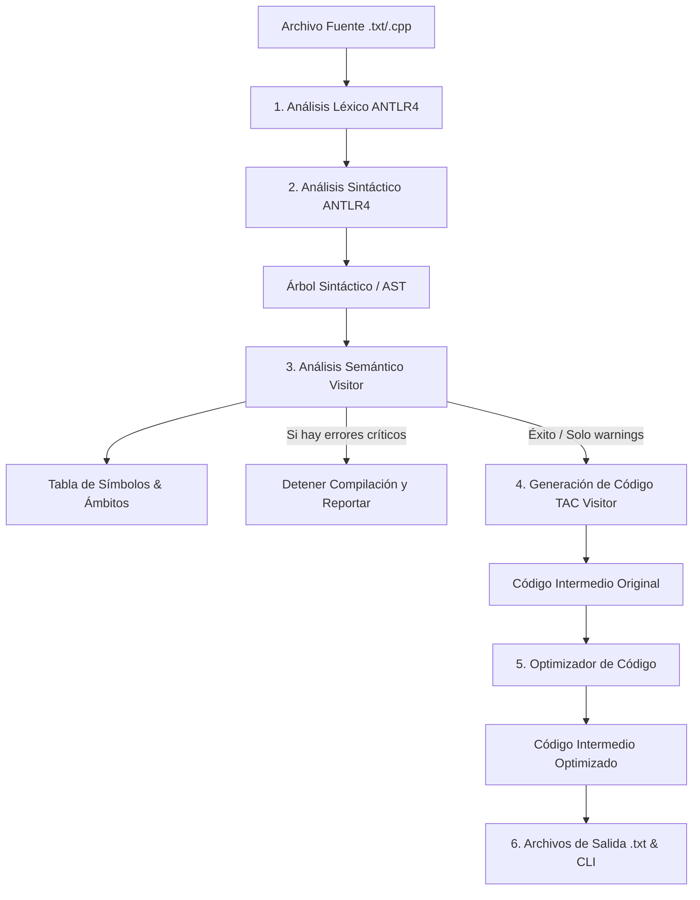

# Informe Técnico: Compilador de C++ a Código de Tres Direcciones (TAC) y Optimizador

Este documento proporciona una explicación técnica y detallada de la arquitectura, diseño e implementación del compilador desarrollado para un subconjunto del lenguaje C++. Su propósito es documentar las decisiones de ingeniería de software, los algoritmos de traducción y optimización aplicados, y servir como sustento del proyecto final de la materia **Técnicas de Compilación**.

---

## 📖 Contenido
1. [Introducción y Objetivos](#1-introducción-y-objetivos)
2. [Especificación del Subconjunto de C++ Soportado](#2-especificación-del-subconjunto-de-c-soportado)
3. [Arquitectura General del Compilador](#3-arquitectura-general-del-compilador)
4. [Implementación Detallada de las Fases de Compilación](#4-implementación-detallada-de-las-fases-de-compilación)
   - [Fase 1: Análisis Léxico](#fase-1-análisis-léxico)
   - [Fase 2: Análisis Sintáctico y Construcción del AST](#fase-2-análisis-sintáctico-y-construcción-del-ast)
   - [Fase 3: Análisis Semántico y Tabla de Símbolos](#fase-3-análisis-semántico-y-tabla-de-símbolos)
   - [Fase 4: Generación de Código Intermedio (TAC)](#fase-4-generación-de-código-intermedio-tac)
   - [Fase 5: Optimización de Código Intermedio](#fase-5-optimización-de-código-intermedio)
   - [Fase 6: Sistema de Reportes e Integración (CLI)](#fase-6-sistema-de-reportes-e-integración-cli)
5. [Análisis de los Casos de Prueba y Resultados](#5-análisis-de-los-casos-de-prueba-y-resultados)
6. [Conclusiones y Lecciones Aprendidas](#6-conclusiones-y-lecciones-aprendidas)

---

## 1. Introducción y Objetivos

El diseño de un compilador es un desafío de ingeniería de software clásico que requiere una estructuración rígida y modular de fases bien delimitadas. El objetivo primordial de este proyecto es implementar un compilador que traduzca código escrito en un **subconjunto del lenguaje C++** hacia una representación intermedia de **Código de Tres Direcciones (TAC)**, aplicando optimizaciones de código independientes de la máquina para generar una salida más eficiente.

### Objetivos Específicos:
*   Diseñar una gramática formal para el subconjunto de C++ utilizando **ANTLR4** en entorno **Java 8**.
*   Validar la corrección contextual (semántica) mediante una tabla de símbolos jerárquica capaz de manejar múltiples ámbitos (*scopes*).
*   Generar código intermedio lineal abstracto utilizando el patrón de diseño **Visitor** para mantener un desacoplamiento limpio entre la sintaxis y la generación de código.
*   Desarrollar un optimizador multipaso que trabaje sobre la representación plana del TAC para reducir la cantidad de instrucciones ejecutadas y el uso de variables temporales.
*   Proporcionar al usuario reportes interactivos coloreados en consola sobre errores sintácticos, léxicos y semánticos, además de alertas (*warnings*) de optimización y uso de variables.

---

## 2. Especificación del Subconjunto de C++ Soportado

El compilador acepta programas estructurados que implementan un núcleo representativo del estándar C++:

*   **Tipos de Datos Básicos**: `int`, `double`, `char`, `bool` y el tipo `void` (exclusivo para firmas de retorno en funciones).
*   **Vectores / Arrays**: Declaración y acceso a arrays unidimensionales de tamaño estático constante (`int arr[10]`).
*   **Estructuras de Control**:
    *   Condicionales: bifurcación simple y compuesta (`if` y `if-else`).
    *   Bucles: bucles con comprobación al inicio (`while`), al final (`do-while`), y bucles indexados con declaraciones locales de inicialización (`for`).
    *   Bifurcaciones múltiples: sentencia `switch-case` que incluye soporte para sentencias de caso individuales y bloque por defecto (`default`).
    *   Flujos de interrupción: sentencias `break` y `continue` para el control fino dentro de bucles y switches.
*   **Funciones**: Declaraciones de funciones con firmas tipadas, múltiples parámetros formales y retorno obligatorio de expresiones compatibles (`return <expr>`) para tipos no-void.
*   **Entrada/Salida básica**: Sentencia especial `print(...)` para visualizar en consola expresiones o cadenas literales.

---

## 3. Arquitectura General del Compilador

El compilador está estructurado como una tubería secuencial (*pipeline*) donde la salida de cada etapa sirve como entrada de la siguiente. Esto asegura una clara separación de incumbencias y facilita la depuración:



### Justificación del Patrón Visitor:
El patrón de diseño **Visitor** nos permite recorrer de forma activa los nodos del árbol de sintaxis generado por ANTLR4 sin tener que modificar las clases de los nodos ni ensuciar la gramática con bloques de código Java empotrado. Al implementar un Visitor para el Análisis Semántico y otro para la Generación de TAC, logramos desacoplar completamente las reglas lógicas de la representación sintáctica.

---

## 4. Implementación Detallada de las Fases de Compilación

### Fase 1: Análisis Léxico

El **Análisis Léxico** tiene como objetivo tomar el flujo continuo de caracteres del archivo fuente y agruparlo en unidades lógicas con significado semántico llamadas **Tokens**.

*   **Definición de Tokens**: En la gramática [MiLenguaje.g4](file:///c:/Users/gasto/OneDrive/Escritorio/Ejercicios_Sintacticos-ejercicio1/Ejercicio/demo/src/main/antlr4/com/compilador/MiLenguaje.g4), definimos tokens para palabras reservadas, operadores, símbolos especiales y patrones genéricos usando Expresiones Regulares (por ejemplo, identificadores `ID : (LETRA | '_') (LETRA | DIGITO | '_')*` y números `INTEGER : DIGITO+`).
*   **Tratamiento de Comentarios y Espacios**: Los comentarios de línea (`//`), de bloque (`/* ... */`) y los espacios en blanco (`WS`) se marcan con la acción `-> skip` en ANTLR. Esto instruye al analizador léxico a ignorar estos caracteres, evitando que el árbol sintáctico se ensucie con información que no aporta lógica estructural.
*   **Manejo de Errores Léxicos**: ANTLR4 por defecto imprime los errores en la salida estándar de error y continúa. En [App.java](file:///c:/Users/gasto/OneDrive/Escritorio/Ejercicios_Sintacticos-ejercicio1/Ejercicio/demo/src/main/java/com/compilador/App.java), eliminamos todos los escuchas de error por defecto (`lexer.removeErrorListeners()`) e implementamos un `BaseErrorListener` propio. Si el analizador léxico encuentra un carácter inválido (como un símbolo `@` o caracteres fuera de las expresiones regulares declaradas), nuestro escuchador captura la línea y la columna exacta y añade el error a una lista de errores léxicos. Si esta lista no está vacía al terminar el proceso, se detiene la compilación y se reportan los errores.

---

### Fase 2: Análisis Sintáctico y Construcción del AST

El **Análisis Sintáctico** evalúa si la secuencia de tokens suministrada por el Lexer cumple con la estructura gramatical del lenguaje, construyendo una jerarquía arbórea llamada Árbol Sintáctico.

*   **Precedencia de Expresiones**: Para evitar ambigüedades en expresiones matemáticas o lógicas (por ejemplo, evaluar `a + b * c` como `a + (b * c)` en lugar de `(a + b) * c`), organizamos las producciones de la regla `expr` (expresión) de arriba hacia abajo de menor a mayor precedencia en [MiLenguaje.g4](file:///c:/Users/gasto/OneDrive/Escritorio/Ejercicios_Sintacticos-ejercicio1/Ejercicio/demo/src/main/antlr4/com/compilador/MiLenguaje.g4). La asignación se ubica en primer lugar, los operadores lógicos (`or`, `and`, `not`) en medio, y los operadores aritméticos más prioritarios (`*`, `/`, `%`) al final. ANTLR4 utiliza estas posiciones relativas para anidar los operadores prioritarios en lo profundo del árbol, forzando su evaluación anticipada.
*   **Visualización Gráfica**: Para verificar la estructura y jerarquía de nuestras derivaciones sintácticas, en [App.java](file:///c:/Users/gasto/OneDrive/Escritorio/Ejercicios_Sintacticos-ejercicio1/Ejercicio/demo/src/main/java/com/compilador/App.java) implementamos el método `mostrarArbolGrafico`. Este método utiliza la clase `TreeViewer` provista por la biblioteca gráfica de ANTLR y la inserta en una ventana Swing (`JFrame`), permitiendo inspeccionar visualmente cada nodo de derivación gramatical en modo gráfico interactivo.

---

### Fase 3: Análisis Semántico y Tabla de Símbolos

El **Análisis Semántico** comprueba que el árbol sintáctico estructurado cumpla con las reglas lógicas y contextuales que la gramática libre de contexto no puede validar. Esta fase se apoya firmemente en una estructura jerárquica de ámbitos para la resolución de nombres.

*   **Tabla de Símbolos y Ámbitos Jerárquicos**:
    Implementado mediante las clases `Symbol`, `Scope` y `TablaSimbolos` en [TablaSimbolos.java](file:///c:/Users/gasto/OneDrive/Escritorio/Ejercicios_Sintacticos-ejercicio1/Ejercicio/demo/src/main/java/com/compilador/TablaSimbolos.java).
    *   La clase `Scope` modela un ámbito individual y contiene un mapa asociativo de nombres a objetos `Symbol`. Mantiene además una referencia a su ámbito superior (`parent`).
    *   La inserción de variables (`insert`) se limita estrictamente al ámbito local (`currentScope`). Esto previene el error de doble declaración en el mismo bloque.
    *   La resolución de nombres (`resolve`) realiza una búsqueda hacia arriba en la jerarquía: si no encuentra la variable en el ámbito local, asciende a través de `parent` hasta llegar al ámbito global. Esto permite soportar el sombreamiento de variables (*shadowing*).
*   **El SemanticVisitor**:
    La clase [SemanticVisitor.java](file:///c:/Users/gasto/OneDrive/Escritorio/Ejercicios_Sintacticos-ejercicio1/Ejercicio/demo/src/main/java/com/compilador/SemanticVisitor.java) hereda de `MiLenguajeBaseVisitor<String>`. Su función principal es validar la coherencia y retornar el tipo de dato correspondiente de cada subnodo (por ejemplo, `"int"`, `"double"`, `"bool"`, `"char"`):
    *   *Verificación de Tipos*: Valida que las asignaciones y operaciones utilicen tipos compatibles. Por ejemplo, evalúa si los operandos de una suma son numéricos, o si se intenta asignar un tipo incompatible (como asignar un valor simple a un array completo).
    *   *Uso de Arrays*: Verifica que los índices utilizados en el acceso a vectores (`arr[idx]`) evalúen estrictamente a un tipo entero (`int`).
    *   *Firmas de Funciones*: En llamadas a funciones, compara que el número y tipo de los argumentos provistos coincidan exactamente con la firma de parámetros guardada en la declaración de la función en la tabla de símbolos.
    *   *Validación de Retornos*: Asegura que las funciones de tipo no-void tengan al menos una sentencia `return` accesible y que la expresión retornada sea del tipo correcto.
    *   *Control de Bucles*: Mantiene una variable entera `loopDepth` que se incrementa al ingresar a bucles y switches. Si se detecta un `break` o `continue` cuando `loopDepth == 0`, reporta un error semántico crítico.
    *   *Warnings de Variables no Usadas*: Al terminar el recorrido del AST, el visitor examina todos los símbolos registrados. Si un símbolo de categoría "variable" o "parámetro" tiene el flag `usado == false`, genera una advertencia (*warning*) indicando al usuario que la variable fue declarada pero nunca consumida, promoviendo la limpieza de código.

---

### Fase 4: Generación de Código Intermedio (TAC)

La generación de código traduce la representación abstracta del AST a una lista plana de instrucciones independientes de la arquitectura de la máquina, utilizando la clase [Instruccion.java](file:///c:/Users/gasto/OneDrive/Escritorio/Ejercicios_Sintacticos-ejercicio1/Ejercicio/demo/src/main/java/com/compilador/Instruccion.java) como representación de la cuádrupla `(op, arg1, arg2, result)`.

*   **Implementación del Visitor**: El generador está en [CodigoVisitor.java](file:///c:/Users/gasto/OneDrive/Escritorio/Ejercicios_Sintacticos-ejercicio1/Ejercicio/demo/src/main/java/com/compilador/CodigoVisitor.java).
*   **Creación de Temporales y Etiquetas**: Se mantiene un contador secuencial para temporales (`t1`, `t2`, ...) y etiquetas (`L1`, `L2`, ...) mediante las funciones `newTemp()` y `newLabel()`.
*   **Estrategia de Aplanamiento**:
    *   *Expresiones*: Visita el subárbol izquierdo y derecho, recupera los temporales donde se almacenaron sus resultados y emite una instrucción plana que los combina en un nuevo temporal.
    *   *Estructuras de Control*:
        *   `if-else`: Genera etiquetas `labelThen`, `labelElse` y `labelEnd`. Evalúa la condición y emite una instrucción condicional (`IF cond goto labelThen`), un salto incondicional (`GOTO labelElse`/`labelEnd`), y las marcas de etiqueta correspondientes para guiar la ejecución lineal.
        *   `while` y `for`: Generan etiquetas para la condición (`labelCond`), el cuerpo del bucle (`labelBody`), el paso del bucle (`labelStep` en `for`), y el final del bucle (`labelEnd`). Para poder desviar correctamente sentencias internas `break` y `continue`, el visitor hace uso de pilas de etiquetas (`loopStartLabels` y `loopEndLabels`) donde mantiene el contexto del bucle activo para realizar un salto directo.
    *   *Gestión de Arrays*: Para lecturas, genera la instrucción `ARRAY_GET array, index, temp` que carga el valor en un temporal. Para escrituras, genera `ARRAY_PUT index, value, array`.

---

### Fase 5: Optimización de Código Intermedio

La optimización busca mejorar la eficiencia en tamaño y rendimiento del código intermedio plano generado por la fase anterior.

*   **Motor de Optimización**: Implementado en [Optimizador.java](file:///c:/Users/gasto/OneDrive/Escritorio/Ejercicios_Sintacticos-ejercicio1/Ejercicio/demo/src/main/java/com/compilador/Optimizador.java).
*   **Enfoque de Punto Fijo**: El optimizador ejecuta las fases secuenciales en un bucle `while`. Dado que la aplicación de una optimización (como propagar una constante) suele habilitar la ejecución de otra (como plegar una expresión aritmética), el motor vuelve a procesar el código de forma iterativa hasta alcanzar estabilidad (cuando una pasada completa no introduce ningún cambio en la cantidad o contenido de las instrucciones) o hasta alcanzar un límite de 10 pasadas.
*   **Técnicas Implementadas**:
    1.  **Plegado de Constantes (Constant Folding)**: Evalúa expresiones cuyos operandos son todos constantes conocidas en tiempo de compilación. Por ejemplo, `t1 = 10 * 2` se reescribe como `t1 = 20`. Soporta aritmética elemental, lógica booleana y comparaciones relacionales.
    2.  **Propagación de Constantes (Constant Propagation)**: Si se asigna un literal constante a una variable (ej. `x = 5`), las apariciones futuras de esa variable se reemplazan por el literal constante en las expresiones.
        *   *Seguridad ante saltos*: La propagación directa de constantes puede inducir a optimizaciones erróneas si la variable cambia su flujo proveniente de un salto condicional o bucle. Para evitar este problema de forma simple y robusta, el optimizador limpia completamente el mapa de constantes (`constMap.clear()`) cada vez que encuentra una etiqueta (`LABEL` o `FUNC_START`), confinando la propagación al bloque plano básico actual.
    3.  **Simplificación Algebraica**: Simplifica operaciones con elementos neutros y nulos matemáticos:
        *   Suma con cero: `x + 0` o `0 + x` $\rightarrow$ `x`
        *   Resta con cero: `x - 0` $\rightarrow$ `x`
        *   Multiplicación por uno: `x * 1` o `1 * x` $\rightarrow$ `x`
        *   Multiplicación por cero: `x * 0` o `0 * x` $\rightarrow$ `0`
    4.  **Eliminación de Código Muerto**:
        *   *Código Inalcanzable*: Al detectar una sentencia de salto incondicional (`GOTO` o `RETURN`), el optimizador marca las instrucciones subsecuentes como inactivas y las descarta hasta encontrar la siguiente etiqueta (`LABEL` o `FUNC_START`), ya que físicamente no hay flujo de ejecución que pueda alcanzarlas.
        *   *Redundancias y Temporales Huérfanos*: Cuenta las referencias de lectura de los temporales artificiales (`t1`, `t2`, ...). Si un temporal es asignado pero su valor se propagó o plegó y ya no se lee en ninguna otra instrucción del programa, la asignación completa se elimina de la lista final. Las llamadas a funciones (`CALL`) no se descartan por tener potenciales efectos secundarios, pero se elimina la variable temporal que capturaba su retorno si no se usa.

---

### Fase 6: Sistema de Reportes e Integración (CLI)

*   **Punto de Entrada**: Centralizado en [App.java](file:///c:/Users/gasto/OneDrive/Escritorio/Ejercicios_Sintacticos-ejercicio1/Ejercicio/demo/src/main/java/com/compilador/App.java).
*   **Control de Errores y Warnings**: Al concluir el análisis semántico, si se detectan errores semánticos críticos, el compilador aborta la ejecución con un código de salida `System.exit(1)`, impidiendo la generación de archivos de código intermedio corruptos. Si solo se producen alertas (como variables declaradas pero no usadas), el sistema emite *warnings* en consola pero continúa el pipeline.
*   **Diferenciación Visual por Colores**: Utiliza códigos de escape ANSI para resaltar visualmente el flujo de compilación y los diagnósticos:
    *   **Verde**: Para indicar fases exitosas e instrucciones optimizadas.
    *   **Amarillo**: Para advertencias de compilación y warnings semánticos.
    *   **Rojo**: Para errores léxicos, sintácticos o semánticos críticos.
*   **Métricas de Desempeño**: Muestra al usuario estadísticas comparativas entre el código de tres direcciones original y el optimizado (número de instrucciones originales vs optimizadas, cantidad de instrucciones eliminadas y porcentaje exacto de reducción de código).

---

## 5. Análisis de los Casos de Prueba y Resultados

El comportamiento del compilador se validó mediante tres casos de prueba diseñados para ejercitar cada una de las fases implementadas:

### 🧪 Caso 1: Código Válido Base (`ejemplo.txt`)
*   **Entrada**: Define variables globales y locales, arrays estáticos, operaciones matemáticas básicas y llamadas de función con retornos.
*   **Resultado**: El compilador analiza correctamente las 52 líneas, genera la tabla de símbolos y produce las 55 instrucciones TAC correspondientes. Reporta un warning semántico debido a que la variable global `activo` fue declarada pero nunca usada en el programa.

### 🧪 Caso 2: Optimizaciones Avanzadas (`ejemplo_optimizacion.txt`)
*   **Entrada**: Un programa diseñado para forzar optimizaciones matemáticas y de control de flujo.
    ```cpp
    x = 5 + 3;
    y = x * 1;
    z = y + 0;
    return z;
    dead = 999;
    ```
*   **Resultado del Pipeline de Optimización**:
    *   **Pasada 1**: `5 + 3` se pliega a `8` e ingresa al mapa como `x = 8`.
    *   **Pasada 2**: La constante `8` se propaga en `y = x * 1` ➔ `y = 8 * 1`, lo cual se simplifica y pliega a `y = 8`.
    *   **Pasada 3**: La constante `8` se propaga en `z = y + 0` ➔ `z = 8 + 0`, simplificándose a `z = 8`.
    *   **Pasada 4**: Se propaga en `return z` ➔ `return 8`. La asignación `dead = 999` posterior al return se remueve por ser inalcanzable.
    *   **Pasada 5**: Los temporales intermedios sin lecturas se detectan como huérfanos y se eliminan del TAC.
    *   **Porcentaje de Reducción**: **26.67%** de instrucciones eliminadas en el archivo optimizado final.

### 🧪 Caso 3: Control de Errores Semánticos (`ejemplo_errores.txt`)
*   **Entrada**: Un código fuente que viola deliberadamente las reglas de tipo y de ámbito (declaraciones duplicadas y variables no declaradas).
*   **Resultado**: El compilador aborta la traducción inmediatamente después de la fase de análisis semántico, imprime en color rojo la línea y columna del error y detiene el flujo de compilación para evitar la generación de archivos corruptos.

---

## 6. Conclusiones y Lecciones Aprendidas

1.  **Desacoplamiento Efectivo**: El uso de patrones **Visitor** y la delimitación estricta de fases permitieron que el compilador sea mantenible y extensible. Separar la lógica de análisis semántico de la generación de código TAC simplificó considerablemente la depuración.
2.  **Importancia de la Optimización por Pasadas**: La implementación de optimizaciones en un bucle multipaso demostró ser una solución elegante al problema de las dependencias entre optimizaciones (donde el plegado de constantes habilita la propagación y viceversa), convergiendo de forma estable a un punto fijo.
3.  **Seguridad en la Tabla de Símbolos**: Modelar los ámbitos de visibilidad de manera anidada mediante referencias al ámbito padre es una solución robusta que emula con precisión el comportamiento de compiladores de producción como GCC o Clang para lenguajes estructurados.
